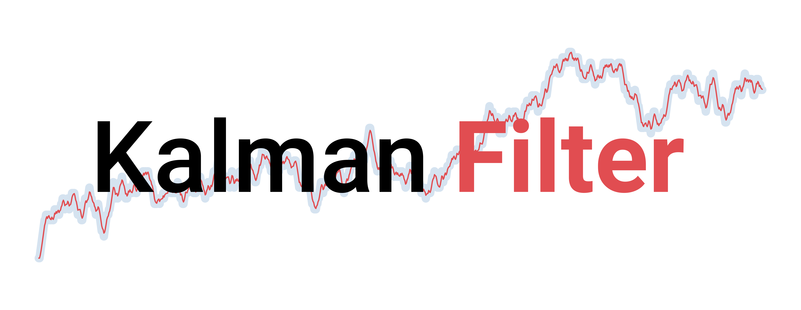
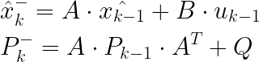
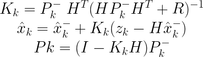
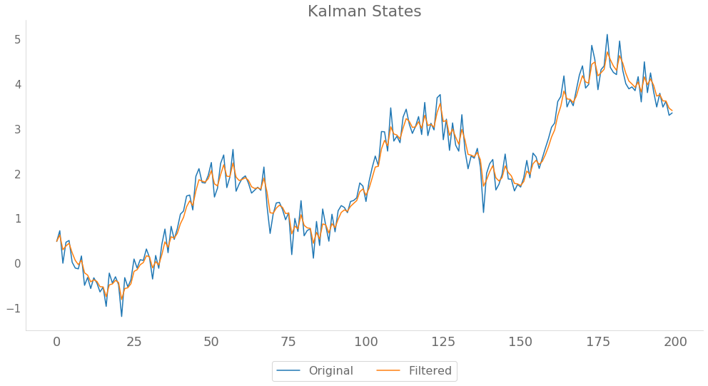

<p align="center">
  
</p>


[](https://xylambda.github.io/kalmanfilter/)

General multidimensional implementation of the Kalman filter algorithm using 
NumPy. The Kalman filter is an optimal estimation algorithm: it is optimal 
in the sense of reducing the expected squared error of the parameters.

The Kalman filter estimates a process by using a form of feedback 
control loop: time update (predict) and measurement update (correct/update).


## Standard Kalman Filter
The standard Kalman Filter (currently the only one supported) can be used to 
model `dynamic linar systems`. It can be summarized by the following expressions:

The prediction step:
<p align="center">
  
</p>

The update step:
<p align="center">
  
</p>

Notice how the Kalman gain regulates the weight between the prediction of the
hidden state and the real observation.

## Installation
Normal user:
```bash
git clone https://github.com/Xylambda/kalmanfilter.git
pip install kalmanfilter/.
```

alternatively:
```bash
git clone https://github.com/Xylambda/kalmanfilter.git
pip install kalmanfilter/. -r kalmanfilter/requirements.txt
```

Developer:
```bash
git clone https://github.com/Xylambda/kalmanfilter.git
pip install -e kalmanfilter/. -r kalmanfilter/requirements-dev.txt
```

## Tests
To run tests you must install the library as a `developer`.
```bash
cd kalmanfilter/
pytest -v tests/
```

## Usage
To make use of the Kalman filter, you only need to decide the value of the 
different parameters. Let's apply the Kalman filter to extract the signal of 
`Ibex 35` financial time series. This series was obtained using 
[investpy](https://github.com/alvarobartt/investpy), but a `.pkl` file is 
provided.
```python
import os
import numpy as np
import pandas as pd
import matplotlib.pyplot as plt

from pathlib import Path
from kalmanfilter import KalmanFilter


DATA_PATH = Path(os.path.abspath('')).parent / "tests/data"

# read data
ibex = pd.read_pickle(DATA_PATH / "ibex35.pkl")

# set the parameters
Z = ibex['Close'].values
A = np.array([[1]])
xk = np.array([[1]])

B = np.array([[0]])
U = np.zeros((len(Z), 1))

Pk = np.array([[1]])
Q = 0.005

H = np.array([[1]])
R = 0.01

# apply kalman filter
kf = KalmanFilter(A=A, xk=xk, B=B, Pk=Pk, H=H, Q=Q, R=R)
states, errors = kf.run_filter(Z, U)

# plot results
fig, ax = plt.subplots(nrows=1, ncols=1, figsize=(17,8))

ibex.plot(ax=ax)
ax.plot(ibex.index, states)
ax.legend(['IBEX 35', 'Filtered IBEX 35'])
ax.set_title("Kalman States")
ax.set_xlabel("");
```


You can also compute the `a posterior estimates` manually:
```python
kf = KalmanFilter(A=A, xk=xk, B=B, Pk=Pk, H=H, Q=Q, R=R)

states = np.zeros_like(Z)
errors = np.zeros_like(Z)

for k, (zk, uk) in enumerate(zip(Z, U)):
    kf.predict(uk)
    kf.update(zk)
    
    states[k] = kf.xk
    errors[k] = kf.Pk
```

Used notation comes mainly from `Bilgin's blog` and a book called `Bayesian
filtering and Smoothing`, by Simo Särkkä. Below you will find more references.

## References
* Matlab - [Understanding Kalman Filters](https://www.youtube.com/playlist?list=PLn8PRpmsu08pzi6EMiYnR-076Mh-q3tWr)

* Bilgin's Blog - [Kalman filter for dummies](http://bilgin.esme.org/BitsAndBytes/KalmanFilterforDummies)

* Greg Welch, Gary Bishop - [An Introduction to the Kalman Filter](https://www.cs.unc.edu/~welch/media/pdf/kalman_intro.pdf)

* Simo Särkkä - Bayesian filtering and Smoothing. Cambridge University Press.